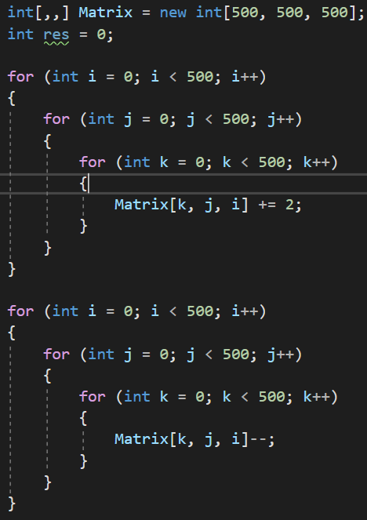
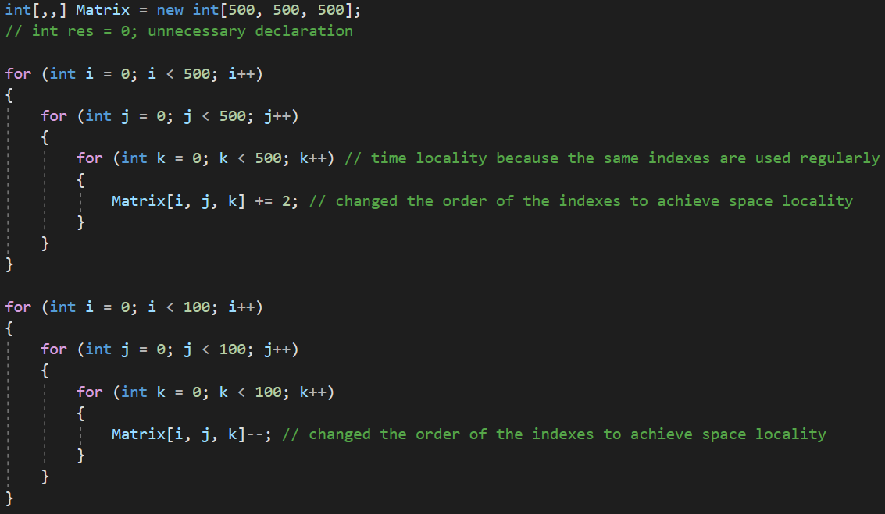
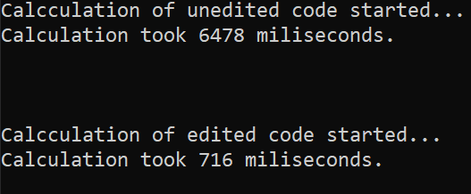

# Memory Optimization
In this project I explored the efficiency of the program in terms of memory management.
## Original code

## Necessary changes and reasons for that
- First of all we can see an exscess variable declaration of `res` variable. it's not used anywhere after declaration so it would be reasonable to remove it.
- Second the access to the three dimensional array is done in a wrong order. because of the way dimensional arrays are implemented in c# the last index has to be most frequent to change, and the first one is the most rare to change. if this guidance is followed, memory is accessed in a sequential order, which means the least number of page misses and as a result a faster code. this is called space locality.
- the indexes of an array do not need to be optimized. they are always used so they follow the time locality which makes their use very fast.
## Changed Code

## Console output of measurements

As we can see from the screenshot, the truposed changes indeed lead to increase of execution speed.
